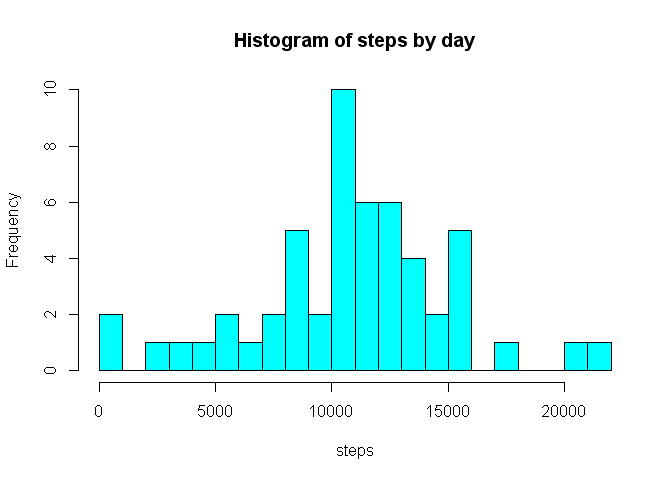
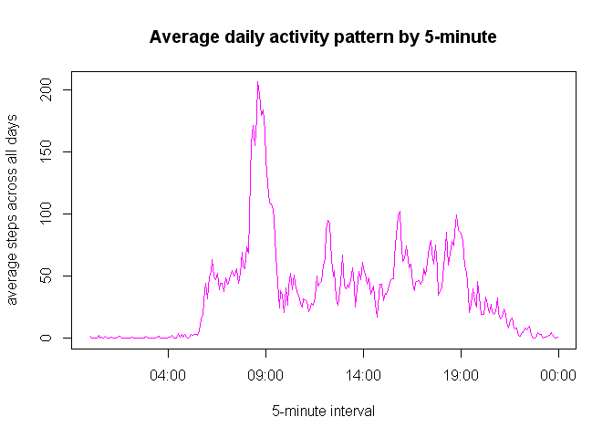
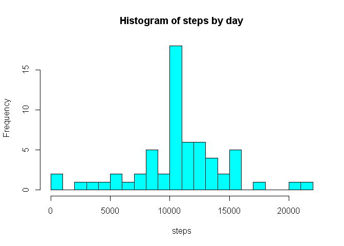
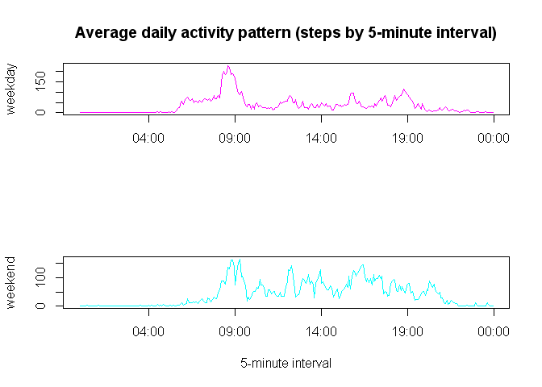

# Reproducible Research: Peer Assessment 1


### Initial settings


Set default to always echo code.


```r
library("knitr")
```

```
## Warning: package 'knitr' was built under R version 3.1.3
```

```r
knitr::opts_chunk$set(echo=TRUE)
```


### Loading and preprocessing the data


*! Warning: A file 'activity.csv' must be placed in the working directory !*


1. Load and take a first look at the data.


```r
# load
dr <- read.csv('./activity.csv', header=TRUE, sep=',', stringsAsFactors=FALSE)
# explore
str(dr)
```

```
## 'data.frame':	17568 obs. of  3 variables:
##  $ steps   : int  NA NA NA NA NA NA NA NA NA NA ...
##  $ date    : chr  "2012-10-01" "2012-10-01" "2012-10-01" "2012-10-01" ...
##  $ interval: int  0 5 10 15 20 25 30 35 40 45 ...
```

There are a NAs in the data, and the class of the field 'date' is a string. Let`s deal with that.


2. Process/transform the data into a format suitable for analysis.


```r
# transform to class 'Date'
dr$date  <- as.Date(dr$date)
# remove NAs
df <- na.omit(dr)
```

For next two parts of the assignment, one can ignore the missing values in the dataset (we will use `df` data frame).


### What is mean total number of steps taken per day?


1. Calculate the total number of steps taken per day.


```r
# aggreagate by day
steps_by_day <- aggregate(x=df$steps, by=list(df$date), FUN=sum)
# name variables
names(steps_by_day) <- c('date', 'steps')
```


2. Make a histogram of the total number of steps taken each day.


```r
# plot histogram of steps by day
hist(x=steps_by_day$steps, breaks = 20, col='cyan', 
     main='Histogram of steps by day', xlab='steps')
```

 

It is worth noting that the distribution of the number of the steps taken per day is far from normal.

### 

3. Calculate and report the mean and median of the total number of steps taken per day.


```r
# mean
mean_steps <- round(mean(steps_by_day$steps) ,3)
# median
median_steps <- round(median(steps_by_day$steps), 3)
```

The mean of the total number of steps taken per day is 10766.189, and the median is 10765.


### What is the average daily activity pattern?


1. Make a time series plot of the 5-minute interval and the average number of steps taken, averaged across all days.

First, lets aggregate steps by interval across all days.


```r
# function mean with round
avg_by_interval <- function (values) {
  result  <- mean(values)
  result <- round(result, 3)
  return(result)
}
# aggregate by interval
steps_by_interval <- aggregate(x=df$steps, by=list(df$interval), 
                               FUN=avg_by_interval)
# name variables
names(steps_by_interval) <- c('interval', 'steps')
# append a time-series variable
start_time = ISOdatetime(2010, 10, 1, 0, 0, 0)
end_time = ISOdatetime(2010, 10, 1, 23, 55, 0)
steps_by_interval$time <- seq.POSIXt(from=start_time, to=end_time, by=300)
```

Then, draw the required plot.


```r
# plot average daily activity pattern by intervals
plot(x=steps_by_interval$time, steps_by_interval$steps, type='l',
     xlab='5-minute interval', ylab='average steps across all days', 
     main='Average daily activity pattern by 5-minute', col='magenta')
```

 

###


2. Which 5-minute interval, on average across all the days in the dataset, contains the maximum number of steps?


```r
# find index which 5-minute interval contains max of steps
index <- which.max(steps_by_interval$steps)[1]
# pull 5-minute interval
max_5_mi <- strftime(x=steps_by_interval[index, 'time'], format='%H:%M')
```

Answer is 08:35.


### Imputing missing values


Note that there are a number of days/intervals where there are missing values (coded as `NA`). The presence of missing days may introduce bias into some calculations or summaries of the data.


1. Lets return to the raw data frame `dr` with `NAs`.


```r
# compute count of NAs in the dataset
na_count <- sum(is.na(dr))
```

The total number of missing values in the dataset (i.e. the total number of rows with `NAs`) is 2304.


2. Devise a strategy for filling in all of the missing values in the dataset. We will use the mean for that 5-minute interval from the data frame `steps_by_intervals`, which is already counted.


```r
# create a merged data set with dr and steps_by_interval
merged <- merge(x=dr, y=steps_by_interval, by.x='interval', by.y='interval')
# replace NAs with mean by 5-minute interval across all days
indexes <- is.na(merged$steps.x)
merged$steps.x[indexes]  <- merged$steps.y[indexes]
```


3. Create a new dataset that is equal to the original dataset but with the missing data filled in.


```r
# create a new dataset without NAs
df <- data.frame(date=merged$date, interval=merged$interval, 
                 steps=merged$steps.x)
# clear memory
remove(merged, steps_by_day, steps_by_interval)
```


4. Make a histogram of the total number of steps taken each day.


```r
# aggreagate by day
steps_by_day <- aggregate(x=df$steps, by=list(df$date), FUN=sum)
# name variables
names(steps_by_day) <- c('date', 'steps')
# plot histogram of steps by day
hist(x=steps_by_day$steps, breaks = 20, col='cyan', 
     main='Histogram of steps by day', xlab='steps')
```

 

```r
# mean
mean_steps_new <- round(mean(steps_by_day$steps) ,3)
# median
median_steps_new <- round(median(steps_by_day$steps), 3)
```

### 

The new mean of the total number of steps taken per day is 10766.188, and the new median is 10766.186. These values differ from the estimates from the first part of the assignment (was 10766.189 and 10765). The impact of imputing missing data on the estimates of the total daily number of steps: the median is close to the mean now, but the mean is still a practically same.


### 
### Are there differences in activity patterns between weekdays and weekends?


1. Create a new factor variable in the dataset with two levels – “weekday” and “weekend” indicating whether a given date is a weekday or weekend day.


```r
# create factor variable
df$day <- factor(format(df$date, '%u') %in% c('6', '7'), 
                 labels=c('weekday', 'weekend'))
# aggregate by 5-minute interval across all days
steps_by_interval <- aggregate(x=df$steps, by=list(df$interval, df$day), 
                               FUN=avg_by_interval)
# name variables
names(steps_by_interval) <- c('interval', 'day', 'steps')
# append a time-series variable
steps_day <- steps_by_interval[steps_by_interval$day=='weekday', ]
steps_end <- steps_by_interval[steps_by_interval$day=='weekend', ]
steps_day$time <- seq.POSIXt(from=start_time, to=end_time, by=300)
steps_end$time <- seq.POSIXt(from=start_time, to=end_time, by=300)
steps_by_interval <- rbind(steps_day, steps_end)
```


2. Make a panel plot containing a time series plot (i.e. type = "l") of the 5-minute interval and the average number of steps taken, averaged across all weekday days or weekend days (using simulated data).


```r
# panle plot
par(mfrow=c(2, 1))
plot(x=steps_day$time, steps_day$steps, type='l', 
     xlab='', ylab='weekday', 
     main='Average daily activity pattern (steps by 5-minute interval)', 
     col='magenta')
#par1 <- c(list(mfg=c(2, 1)), par(pars))
plot(x=steps_end$time, steps_end$steps, type='l', 
     xlab='5-minute interval', ylab='weekend', 
     col='cyan')
```

 

###

Interestingly, in the weekends, the number of performed steps is more evenly distributed over time.
